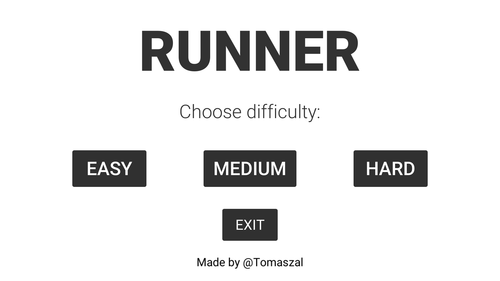
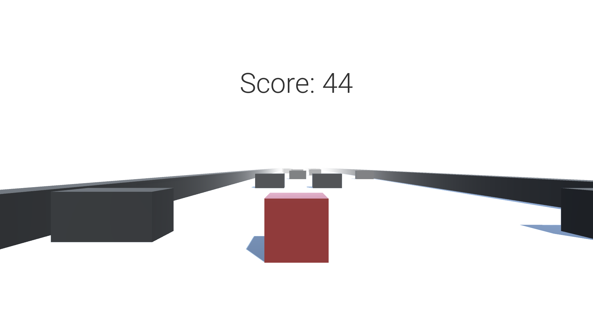
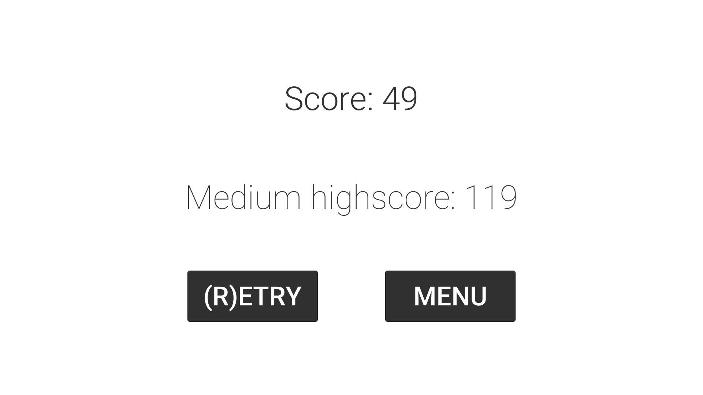

# Runner
I have created this simple game in an effort to learn how Unity3D works. I have tried to keep this project clean and easily readable. However, it was created with educational purposes so the code is most likely not optimal. 

##  Gameplay
+ You are a red cube moving forward through an endless path.
+ Your only goal is to survive as long as you can by swerving to avoid obstacles.
+ There are three difficulties to choose from which determine your speed.

## Controls
+ `A` or `<-` - Move left
+ `D` or `->` - Move right
+ `R` - Restart
+ `Esc` - Exit to menu

## Screenshots
 |  | 
:---:|:---:|:---:
Main menu | Gameplay | Death screen
